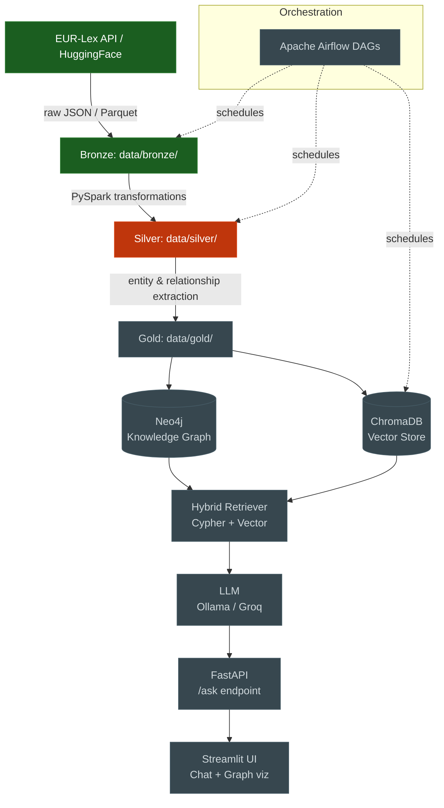

# EuGraphRAG

> A GraphRAG pipeline over EU legislation, built layer by layer from raw EUR-Lex data to a hybrid Knowledge Graph + Vector Search chatbot.

Personal learning project by **Marc Ramon Moreno** to build a hybrid Data Engineer + AI Engineer portfolio piece, motivated by skill gaps identified after a technical interview at [Velorum Labs AI](https://www.velorumlabs.ai/) (Barcelona). The repo is built **incrementally over ~12 weeks** so that each commit reflects one concrete tool or concept learned end-to-end, not a single drop of a finished system.

---

## Architecture



Green = done · Orange = in progress · Grey = upcoming

---

## Status

| Week | Phase | Topic | Status |
|:----:|:-----:|-------|:------:|
| 1 | DE foundations | Advanced SQL + star schema modelling (Postgres) | ✅ done |
| 2 | DE foundations | PySpark fundamentals (DataFrames, lazy eval, windows, joins) | ✅ done |
| 3 | DE foundations | PySpark pipeline: HF → Bronze → Silver (Parquet, medallion) | 🟧 bronze done; silver pending |
| 4 | DE foundations | Apache Airflow: DAGs orchestrating the PySpark pipeline | ⬜ |
| 5 | Knowledge Graphs | Neo4j + Cypher fundamentals | ⬜ |
| 6 | Knowledge Graphs | EUGraphRAG ontology + bulk load into Neo4j | ⬜ |
| 7 | Knowledge Graphs | NetworkX analysis (PageRank, communities, centrality) | ⬜ |
| 8 | AI Engineering | Embeddings (sentence-transformers) + ChromaDB | ⬜ |
| 9 | AI Engineering | RAG pipeline with LangChain | ⬜ |
| 10 | AI Engineering | GraphRAG: hybrid vector + Cypher retriever | ⬜ |
| 11 | Productionization | Docker Compose full stack + FastAPI + CI/CD | ⬜ |
| 12 | Productionization | README, demo, LinkedIn publication | ⬜ |

The detailed weekly notes live in [`CLAUDE.md`](./CLAUDE.md) (project context + learning plan).

---

## Quick start

### Prerequisites
- Docker Desktop (with Compose v2)
- ~6 GB free RAM for the Spark container
- `make` (Windows users: via Git Bash, WSL, or `choco install make`)

### Bring up the stack

```bash
docker compose up -d         # postgres + spark/jupyter containers
make ps                      # verify both are healthy
make jupyter                 # prints the JupyterLab URL with the token
```

### What you can run today (Weeks 1–3)

**Week 1 — SQL exercises** (Postgres):
```bash
make db                                          # opens psql in the eurlex DB
# or open notebooks/01_sql_exercises.ipynb in JupyterLab
```

**Week 2 — PySpark intro** (in-container Jupyter):
```bash
# Open notebooks/02_pyspark_intro.ipynb via JupyterLab
# 9 blocks + 4 exercises covering DataFrames, lazy eval, joins, windows, partitions
```

**Week 3 — Bronze ingestion** (HuggingFace → Parquet):
```bash
make ingest-bronze                               # 500 docs from NLP-AUEB/eurlex
ls data/bronze/eurlex/                           # part-*.snappy.parquet files
```

Or invoke the CLI directly with custom parameters:
```bash
docker exec eugraphrag-spark sh -c \
  'cd /home/jovyan/work && python -m spark.ingestion \
    --split train --subset-size 5000 \
    --output data/bronze/eurlex'
```

### Tests

```bash
make test-container          # 4 unit tests, no network (Spark startup ~10s)
make test-integration        # adds 1 smoke test (downloads from HF)
```

---

## Tech stack

| Category | Tool | Used in |
|---|---|---|
| Distributed processing | PySpark 4.x | Weeks 2–3 |
| Data format | Apache Parquet (snappy) | Week 3 |
| Data source | HuggingFace `datasets` + EUR-Lex | Week 3 |
| RDBMS | PostgreSQL 16 (star schema) | Week 1 |
| Orchestration | Apache Airflow | Week 4 (upcoming) |
| Graph database | Neo4j + Cypher | Weeks 5–6 (upcoming) |
| Graph analysis | NetworkX | Week 7 (upcoming) |
| Vector store | ChromaDB | Week 8 (upcoming) |
| Embeddings | sentence-transformers | Week 8 (upcoming) |
| LLM | Ollama (local) / Groq (free tier) | Week 9 (upcoming) |
| RAG framework | LangChain | Weeks 9–10 (upcoming) |
| API | FastAPI | Week 11 (upcoming) |
| Frontend | Streamlit | Week 11 (upcoming) |
| Containerization | Docker Compose | All |
| CI/CD | GitHub Actions | Week 11 (upcoming) |

---

## Repository structure

```
eugraphrag/
├── CLAUDE.md                 # Project context, ontology, learning plan
├── README.md                 # This file
├── docker-compose.yml        # postgres + spark/jupyter
├── Makefile                  # up/down, ingest-bronze, test-*, jupyter
├── pyproject.toml            # Pinned deps (e.g. datasets<3 for legacy scripts)
│
├── sql/init/                 # Postgres init: star schema + seed data (W1)
├── notebooks/
│   ├── 01_sql_exercises.ipynb        # ✅ window fns, CTEs, bridge fan-out
│   ├── 02_pyspark_intro.ipynb        # ✅ DataFrames, lazy eval, joins, windows
│   └── 03_pyspark_pipeline.ipynb     # ✅ HF dataset exploration
│
├── spark/                    # PySpark pipeline modules (extracted from notebooks)
│   ├── schemas.py            # ✅ EURLEX_BRONZE_SCHEMA (single source of truth)
│   └── ingestion.py          # ✅ HF → Bronze Parquet, CLI entry point
│
├── tests/
│   ├── conftest.py           # ✅ Session-scoped SparkSession fixture
│   └── test_ingestion.py     # ✅ 4 unit tests + 1 @pytest.mark.integration
│
└── data/
    ├── bronze/               # Raw Parquet from HuggingFace (gitignored)
    ├── silver/               # Cleaned, partitioned (gitignored, W3 pending)
    └── gold/                 # Entities & relationships (gitignored, W6)
```

---

## Knowledge Graph ontology (target)

The EU legislation domain is modelled as:

| Node | Properties | Example |
|---|---|---|
| `Document` | `celex_id`, `title`, `date`, `type` | "Regulation (EU) 727/2014" |
| `Article` | `number`, `text` | Article 3 of a regulation |
| `Country` | `name`, `code` | "Spain", "ES" |
| `Institution` | `name`, `type` | "European Commission" |
| `Topic` | `eurovoc_id`, `name` | EuroVoc concept 1402 |
| `Amendment` | `id`, `date` | — |

| Relationship | Cardinality |
|---|---|
| `(:Document)-[:CONTAINS]->(:Article)` | 1-N |
| `(:Document)-[:REFERENCES]->(:Document)` | N-N |
| `(:Document)-[:AMENDS]->(:Document)` | N-N |
| `(:Document)-[:AFFECTS]->(:Country)` | N-N |
| `(:Document)-[:ISSUED_BY]->(:Institution)` | N-1 |
| `(:Document)-[:BELONGS_TO]->(:Topic)` | N-N |
| `(:Amendment)-[:MODIFIES]->(:Document)` | N-1 |

The `BELONGS_TO` edge will be hydrated from the `eurovoc_concepts` field on bronze.

---

## Design decisions worth flagging

A few non-obvious decisions made along the way, kept here so future-me (and reviewers) don't re-derive them:

1. **`datasets>=2.18,<3`** — `datasets>=3.0` removed support for loading scripts, and almost every well-maintained EU legal corpus on HuggingFace (`NLP-AUEB/eurlex`, `coastalcph/multi_eurlex`, …) still ships with one. Upper bound the dep.
2. **`eurovoc_concepts: Array<String>`, not `Array<Long>`** — EuroVoc codes look numeric (`"1402"`, `"2771"`) but the EU publishes them as opaque identifiers. Treating them as integers invites silent breakage if a code ever contains a non-digit.
3. **HF → temp Parquet → Spark → final Parquet**, not `Dataset.to_pandas() → spark.createDataFrame()` — the pandas intermediate would OOM on the full 57k-doc dataset. The intermediate Parquet is throwaway but lets Spark apply the explicit schema during read.
4. **Parquet doesn't preserve `nullable=False`** on round-trip — the constraint applies only at write time. Strict null validation belongs in a dedicated `quality_checks.py` module run at every layer boundary.
5. **Mounts are explicit, not whole-project** — `./:/home/jovyan/work` would pull `.git/` into the container and tank I/O on Windows (WSL2 bind-mount overhead). We mount only `./spark`, `./tests`, `./notebooks`, `./data`, `./pyproject.toml`.

---

## Author

**Marc Ramon Moreno** — AI and computational engineer, Barcelona.
Currently Process & Project Engineer at IPB-Chemgineering Spain. Previously Bioprocess & Control Engineer at the ESA MELiSSA Pilot Plant (full-stack data platform), Junior OpenMP Developer at the Barcelona Supercomputing Center (LLVM/Clang, C++23, CUDA on RISC-V).

📚 Postgrad AI w/ Deep Learning (UPC ETSETB) · MSc Modelling for Science and Engineering (UAB) · BSc Biosystems Engineering (UPC)
🔗 [GitHub](https://github.com/MarcRamonMoreno) · marc.ramon6@gmail.com

---

## License

The code in this repository is released under the MIT License (see `pyproject.toml`).
EU legislation data ingested from EUR-Lex via the [NLP-AUEB/eurlex](https://huggingface.co/datasets/NLP-AUEB/eurlex) dataset is licensed under CC-BY-SA-4.0 by its original publishers.
